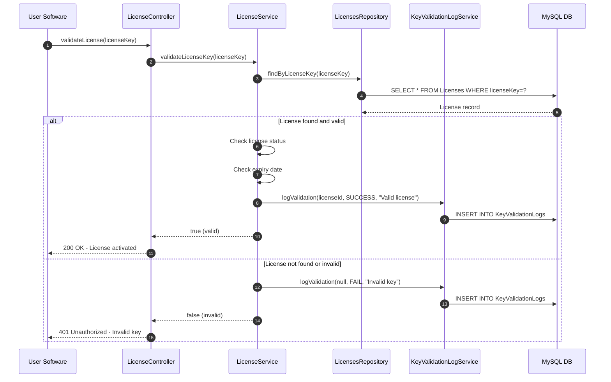

# Software Design Specification (SDS)
## BUM - Buy Unique Marketplace

**Project:** SWP391.B5  
**Student:** Hà Vũ Long - HE186065  
**Class:** K18  
**Date:** December 14, 2025

---

## II. Software Design Document

### 1. High Level Design

#### 1.1 Software Architecture

*[The content of this section includes the overall architectural diagram which includes the sub-systems and/or components, the external systems (if any), and the relationships (communication messages) among them. You need also provide the explanation for each of the diagram components (modules, sub-systems, external systems, etc.)]*.

---

### **System Architecture Overview**

The BUM (Buy Unique Marketplace) system is built using **Spring Boot 3.5.8** framework following a **Three-Tier Layered Architecture** pattern with **MVC (Model-View-Controller)** design. The system is designed as a monolithic web application with clear separation of concerns across presentation, business logic, and data access layers.

#### **Mermaid Diagram (Interactive - Copy to https://mermaid.live)**

```mermaid
flowchart TB
    subgraph Client["🌐 CLIENT LAYER"]
        Browser["Web Browser<br/>(HTML5, CSS3, JavaScript)"]
    end
    
    subgraph SystemArch["📦 BUM SYSTEM ARCHITECTURE"]
        subgraph PresentationLayer["🎯 PRESENTATION LOGIC LAYER"]
            Controllers["Controllers<br/>────────────<br/>• AuthController<br/>• HomeController<br/>• ProductController<br/>• OrderController<br/>• UserController<br/>• TransactionController<br/>• LicenseController<br/>• ReviewController<br/>• CategoryController<br/>• DashboardController<br/>• ActivityLogController<br/>• CustomErrorController"]
        end
        
        subgraph ViewLayer["🎨 USER INTERFACE LAYER"]
            Templates["Thymeleaf Templates<br/>────────────<br/>• login.html<br/>• Home.html<br/>• products.html<br/>• product.html<br/>• orders.html<br/>• order-success/failure.html<br/>• admin/user/dev-dashboard.html<br/>• profile.html<br/>• 403/404/500.html"]
        end
        
        subgraph ModelLayer["📊 MODEL CLASSES LAYER"]
            Entities["JPA Entities & DTOs<br/>────────────<br/>• Users<br/>• Products<br/>• Orders<br/>• Transactions<br/>• Licenses<br/>• Categories<br/>• Reviews<br/>• ProductVersions<br/>• ProductPackages<br/>• ActivityLogs<br/>• KeyValidationLogs"]
        end
        
        subgraph CommonLayer["⚙️ COMMON CLASSES LAYER"]
            Config["Configuration & Security<br/>────────────<br/>• Spring Security Config<br/>• CustomUserDetailsService<br/>• ValidationConfig<br/>• PaymentConfig VNPay<br/>• HibernateConfig<br/>• ExceptionHandlers"]
        end
        
        subgraph ServiceLayer["💼 SERVICE LAYER"]
            Services["Business Logic Services<br/>────────────<br/>• UserService<br/>• ProductService<br/>• OrderService<br/>• TransactionService<br/>• LicenseService<br/>• CategoryService<br/>• ReviewService<br/>• ActivityLogService<br/>• ProductVersionService<br/>• ProductPackageService<br/>• KeyValidationLogService"]
        end
        
        subgraph DataLayer["💾 DATA ACCESS LAYER"]
            Repositories["Spring Data JPA Repositories<br/>────────────<br/>• UserRepository<br/>• ProductRepository<br/>• OrderRepository<br/>• TransactionRepository<br/>• LicenseRepository<br/>• CategoryRepository<br/>• ReviewRepository<br/>• ActivityLogRepository<br/>• ProductVersionRepository<br/>• ProductPackageRepository<br/>• KeyValidationLogRepository<br/><br/>🔧 Hibernate ORM + HikariCP Pool"]
        end
    end
    
    subgraph Database["🗄️ DATABASE LAYER"]
        MySQL["MySQL Database<br/>────────────<br/>Host: smiledev.id.vn:3306<br/>DB: smiledev_2004<br/><br/>Tables:<br/>• Users, Products, Orders<br/>• Transactions, Licenses<br/>• Categories, Reviews<br/>• ProductVersions<br/>• ProductPackages<br/>• ActivityLogs<br/>• KeyValidationLogs"]
    end
    
    subgraph External["🌍 EXTERNAL SYSTEMS"]
        VNPay["VNPay Payment Gateway<br/>────────────<br/>Environment: Sandbox<br/>URL: vnpayment.vn<br/>Version: 2.1.0<br/><br/>• Payment Processing<br/>• Transaction Callback<br/>• HMAC SHA-256 Security"]
    end
    
    Browser <-->|"HTTP Request<br/>HTTP Response"| Controllers
    Controllers <-->|"Forward Model"| Templates
    Controllers <-->|"Data Binding"| Entities
    Controllers -->|"Call Business Logic"| Services
    Services <-->|"Use Configuration"| Config
    Services <-->|"Transform Data"| Entities
    Services -->|"CRUD Operations"| Repositories
    Repositories <-->|"JDBC Connection<br/>HikariCP Pool (2 conn)"| MySQL
    Services <-->|"REST API<br/>HTTPS"| VNPay
    
    classDef clientStyle fill:#e1f5ff,stroke:#01579b,stroke-width:2px,color:#000
    classDef controllerStyle fill:#fff9c4,stroke:#f57f17,stroke-width:2px,color:#000
    classDef viewStyle fill:#f3e5f5,stroke:#4a148c,stroke-width:2px,color:#000
    classDef modelStyle fill:#e8f5e9,stroke:#1b5e20,stroke-width:2px,color:#000
    classDef configStyle fill:#fff3e0,stroke:#e65100,stroke-width:2px,color:#000
    classDef serviceStyle fill:#e3f2fd,stroke:#0d47a1,stroke-width:2px,color:#000
    classDef dataStyle fill:#fce4ec,stroke:#880e4f,stroke-width:2px,color:#000
    classDef dbStyle fill:#f1f8e9,stroke:#33691e,stroke-width:3px,color:#000
    classDef extStyle fill:#ede7f6,stroke:#311b92,stroke-width:3px,color:#000
    
    class Browser clientStyle
    class Controllers controllerStyle
    class Templates viewStyle
    class Entities modelStyle
    class Config configStyle
    class Services serviceStyle
    class Repositories dataStyle
    class MySQL dbStyle
    class VNPay extStyle
```



---

### **Detailed Component Explanation**

#### **1. Web Browser (Client Tier)**

**Description:**  
The client-side interface accessed through standard web browsers (Chrome, Firefox, Safari, Edge). Users interact with the system through this layer.

**Components:**
- HTML5 pages rendered by Thymeleaf template engine
- CSS styling (style.css) for visual presentation
- JavaScript (main.js) for client-side interactivity and AJAX requests

**Communication:**
- Sends HTTP/HTTPS requests to the Presentation Logic Layer
- Receives HTTP responses (HTML pages, JSON data)

---

#### **2. Presentation Logic Layer (Controller Layer)**

**Description:**  
This layer handles incoming HTTP requests, performs request routing, validates user input, and coordinates between the Service Layer and User Interface Layer. It implements the **Controller** component of the MVC pattern.

**Components:**

| Controller | Responsibility |
|-----------|---------------|
| **AuthController** | User authentication (login, logout, registration) |
| **HomeController** | Landing page and public content management |
| **ProductController** | Product CRUD operations, search, filtering |
| **ProductVersionController** | Product version management |
| **ProductPackageController** | Product package bundling operations |
| **OrderController** | Order creation, payment processing, order tracking |
| **TransactionController** | Transaction history and financial records |
| **LicenseController** | Software license key generation and management |
| **KeyValidationLogController** | License validation tracking |
| **ReviewController** | Product review submission and management |
| **UserController** | User profile management, account settings |
| **CategoryController** | Product category CRUD operations |
| **DashboardController** | Role-based dashboard routing (Admin/User/Developer) |
| **ActivityLogController** | System activity audit log management |
| **CustomErrorController** | Custom error page handling (403, 404, 500) |

**Technology:**
- Spring MVC annotations (@Controller, @RequestMapping, @GetMapping, @PostMapping)
- Request/Response handling
- Session management
- Model attribute binding

**Communication:**
- Receives HTTP requests from Web Browser
- Calls Service Layer for business logic execution
- Forwards data to User Interface Layer (Thymeleaf templates)
- Returns HTTP responses (HTML views or JSON)

---

#### **3. User Interface Layer (View Layer)**

**Description:**  
Server-side rendered HTML templates using **Thymeleaf template engine**. This layer implements the **View** component of the MVC pattern, responsible for presenting data to users.

**Components:**

**Authentication & Authorization:**
- `login.html` - User login form
- `403.html` - Access denied error page

**Public Pages:**
- `Home.html` - Landing page with featured products
- `products.html` - Product listing page with search/filter
- `product.html` - Detailed product information page

**User Management:**
- `profile.html` - User profile and account settings

**Order & Payment:**
- `orders.html` - Order history and management
- `order-details.html` - Detailed order information
- `order-success.html` - Payment success confirmation
- `order-failure.html` - Payment failure notification

**Dashboards (Role-Based):**
- `admin-dashboard.html` - Administrator control panel
- `user-dashboard.html` - End-user dashboard
- `developer-dashboard.html` - Software developer dashboard

**Error Pages:**
- `error.html` - General error page
- `error/404.html` - Page not found
- `error/500.html` - Internal server error

**Shared Components:**
- `layout.html` - Master layout template with header/footer

**Technology:**
- Thymeleaf template engine
- Thymeleaf Spring Security dialect for security expressions
- HTML5, CSS3 (Bootstrap or custom)
- JavaScript for dynamic interactions

**Communication:**
- Receives model data from Presentation Logic Layer
- Renders HTML pages with dynamic content
- Sends rendered HTML to Web Browser

---

#### **4. Model Classes Layer (Entity & DTO Layer)**

**Description:**  
Represents the **Model** component of the MVC pattern. Contains domain entities (database-mapped objects) and DTOs (Data Transfer Objects) for data exchange between layers.

**Entity Classes (JPA Entities):**

| Entity | Description |
|--------|-------------|
| **Users** | User account information (credentials, profile, role) |
| **Products** | Product master data (name, description, price, developer) |
| **ProductVersions** | Version information for each product |
| **ProductPackages** | Product package/bundle configurations |
| **Categories** | Product categorization hierarchy |
| **Orders** | Customer order records with status tracking |
| **Transactions** | Payment transaction details (VNPay) |
| **Licenses** | Software license keys and activation status |
| **Reviews** | Product reviews with ratings |
| **ActivityLogs** | System audit trail (user actions, timestamps) |
| **KeyValidationLogs** | License key validation history |

**DTO Classes:**
- Request DTOs: Encapsulate incoming request data with validation annotations
- Response DTOs: Format outgoing data for API responses
- Form DTOs: Bind form data from user interface

**Technology:**
- JPA (Java Persistence API) annotations
- Lombok for boilerplate code reduction
- Jakarta Bean Validation for input validation

**Communication:**
- Used by Service Layer for business logic processing
- Mapped to/from database by Data Access Layer
- Transferred to Presentation Layer via DTOs

---

#### **5. Common Classes Layer (Configuration & Shared Services)**

**Description:**  
Contains cross-cutting concerns, configuration classes, and shared utilities used across multiple layers. This layer provides foundational services for the entire application.

**Components:**

**Security Configuration:**
- **SecurityConfig**: Spring Security setup
  - Authentication configuration (login, logout)
  - Authorization rules (role-based access control)
  - CSRF protection
  - Session management
  - Password encoding (BCrypt)

- **CustomUserDetailsService**: User authentication service
  - Loads user details from database
  - Integrates with Spring Security

**Payment Configuration:**
- **PaymentConfig**: VNPay integration settings
  - API endpoint configuration
  - TMN Code and Hash Secret
  - Payment callback URL configuration

**Validation Configuration:**
- Custom validators for business rules
- Bean validation configurations
- Error message customization

**Hibernate/JPA Configuration:**
- Data source configuration
- Entity scanning
- Transaction management
- Connection pooling (HikariCP)

**Exception Handling:**
- Global exception handlers
- Custom exception classes
- Error response formatting

**Technology:**
- Spring Boot auto-configuration
- Spring Security
- Custom @Configuration classes

---

#### **6. Service Layer (Business Logic Layer)**

**Description:**  
Contains core business logic, workflows, and orchestration between different components. This layer ensures business rules are enforced and provides transactional operations.

**Service Classes:**

| Service | Business Logic Responsibilities |
|---------|--------------------------------|
| **UserService** | User registration, profile management, role assignment |
| **ProductService** | Product management, availability checking, price calculation |
| **ProductVersionService** | Version control, release management |
| **ProductPackageService** | Package creation, bundling logic |
| **CategoryService** | Category hierarchy management, product categorization |
| **OrderService** | Order workflow (create, process, fulfill, cancel), status tracking |
| **TransactionService** | Payment processing, transaction recording, refund handling |
| **LicenseService** | License key generation, validation, activation/deactivation |
| **ReviewService** | Review submission, rating aggregation, moderation |
| **ActivityLogService** | Audit logging, activity tracking |
| **KeyValidationLogService** | License validation logging and reporting |
| **CustomUserDetailsService** | Spring Security user details loading |

**Key Responsibilities:**
- Implement business rules and validations
- Coordinate operations across multiple repositories
- Manage transactions with @Transactional
- Transform entities to DTOs and vice versa
- Handle business exceptions

**Technology:**
- Spring Service annotations (@Service)
- Transactional management (@Transactional)
- Dependency injection
- Business logic implementation

**Communication:**
- Called by Presentation Logic Layer (Controllers)
- Calls Data Access Layer (Repositories)
- Invokes external systems (VNPay API)

---

#### **7. Data Access Layer (Repository/DAO Layer)**

**Description:**  
Provides abstraction for database operations using **Spring Data JPA**. This layer handles all database interactions, query execution, and data persistence.

**Repository Interfaces:**

| Repository | Database Operations |
|-----------|-------------------|
| **UserRepository** | User CRUD, find by username/email, role queries |
| **ProductRepository** | Product CRUD, search, filtering by category/developer |
| **ProductVersionRepository** | Version CRUD, find by product |
| **ProductPackageRepository** | Package CRUD, bundling queries |
| **CategoryRepository** | Category CRUD, hierarchy queries |
| **OrderRepository** | Order CRUD, find by user, status filtering |
| **TransactionRepository** | Transaction CRUD, payment history |
| **LicenseRepository** | License CRUD, validation, find by key |
| **ReviewRepository** | Review CRUD, rating aggregation |
| **ActivityLogRepository** | Log CRUD, audit trail queries |
| **KeyValidationLogRepository** | Validation log CRUD, reporting queries |

**Technology:**
- **Spring Data JPA**: Repository abstraction
- **Hibernate ORM**: Object-relational mapping
- **HikariCP**: Connection pooling
  - Maximum pool size: 2 connections
  - Minimum idle: 2 connections
  - Connection timeout: 10 seconds
  - Idle timeout: 30 seconds
- **JDBC**: MySQL Connector/J driver

**Features:**
- Automatic CRUD operations
- Custom query methods (derived queries)
- Native SQL queries (if needed)
- Pagination and sorting support
- Transaction management

**Communication:**
- Called by Service Layer
- Executes SQL queries via Hibernate/JDBC
- Interacts with MySQL Database

---

#### **8. MySQL Database**

**Description:**  
Relational database system storing all application data. Hosted remotely on external server.

**Configuration:**
- **Host**: smiledev.id.vn:3306
- **Database Name**: smiledev_2004
- **Connection**: JDBC with HikariCP connection pooling
- **Dialect**: MySQL 8.x

**Database Schema:**

**User Management:**
- Users table (user accounts, credentials, roles)

**Product Management:**
- Products table (product catalog)
- ProductVersions table (version tracking)
- ProductPackages table (package/bundle configurations)
- Categories table (product categories)

**Order & Transaction:**
- Orders table (customer orders)
- Transactions table (payment records)

**License Management:**
- Licenses table (software license keys)
- KeyValidationLogs table (validation history)

**Review & Audit:**
- Reviews table (product reviews and ratings)
- ActivityLogs table (system audit trail)

**Database Settings:**
- DDL Auto: validate (schema validation only, no auto-creation)
- Physical Naming Strategy: Standard (preserves column names as-is)
- Open-in-view: false (prevents lazy loading issues)

**Communication:**
- Receives SQL queries from Data Access Layer via JDBC
- Returns result sets to application

---

#### **9. External System: VNPay Payment Gateway**

**Description:**  
Third-party payment processing service integrated for online payment functionality. Uses VNPay's sandbox environment for testing and development.

**Integration Details:**

**API Configuration:**
- **Payment URL**: https://sandbox.vnpayment.vn/paymentv2/vpcpay.html
- **API URL**: https://sandbox.vnpayment.vn/merchant_webapi/api/transaction
- **Return URL**: http://localhost:8080/orders/vnpay-callback
- **TMN Code**: S5FSJX1Y
- **Hash Secret**: OMKFYSJDE5I17FBZD3FV8YVJ2E1PXKKV
- **API Version**: 2.1.0

**Payment Flow:**

1. **Payment Initiation:**
   - User selects product and proceeds to checkout
   - OrderController creates order with "PENDING" status
   - System generates VNPay payment request with order details
   - User redirects to VNPay payment portal

2. **Payment Processing:**
   - User enters payment information on VNPay portal
   - VNPay processes payment transaction
   - VNPay validates payment and updates transaction status

3. **Payment Callback:**
   - VNPay redirects back to system's callback URL
   - OrderController.vnpayCallback() receives payment result
   - System validates callback signature using hash secret
   - Order and transaction status updated based on payment result
   - License key generated if payment successful
   - User redirected to success/failure page

**Security:**
- HMAC SHA-256 signature validation
- Secure hash secret for request signing
- HTTPS communication
- Transaction verification

**Communication Protocol:**
- REST API over HTTPS
- HTTP POST requests for payment initiation
- HTTP GET callback for payment result
- JSON/URL-encoded parameter exchange

---

### **Architectural Patterns and Design Principles**

#### **1. Three-Tier Layered Architecture**
- **Presentation Tier**: Controllers + Views
- **Application Tier**: Service Layer + Business Logic
- **Data Tier**: Data Access Layer + Database

#### **2. MVC (Model-View-Controller) Pattern**
- **Model**: Entity classes + DTOs
- **View**: Thymeleaf templates
- **Controller**: Spring MVC Controllers

#### **3. Dependency Injection (DI)**
- Spring Framework manages all component dependencies
- Constructor injection for required dependencies
- Loose coupling between layers

#### **4. Repository Pattern**
- Abstract data access through repository interfaces
- Decouples business logic from data persistence

#### **5. DTO (Data Transfer Object) Pattern**
- Separate internal domain models from external representations
- Reduce unnecessary data exposure
- Optimize network payload

#### **6. Service Layer Pattern**
- Encapsulate business logic in dedicated service classes
- Provide transactional boundaries
- Coordinate operations across multiple repositories

#### **7. Security by Design**
- Spring Security integration at all entry points
- Role-based access control (RBAC)
- CSRF protection enabled
- Secure password storage (BCrypt)

---

### **Communication Flow Example: Order Processing with Payment**

```
1. User → Web Browser: Click "Buy Product"
2. Web Browser → OrderController: POST /orders/create
3. OrderController → OrderService: createOrder(orderData)
4. OrderService → ProductService: validateProductAvailability()
5. ProductService → ProductRepository: findById(productId)
6. ProductRepository → MySQL: SELECT * FROM Products WHERE id = ?
7. MySQL → ProductRepository: Product data
8. ProductRepository → ProductService: Product entity
9. ProductService → OrderService: Product available
10. OrderService → OrderRepository: save(order)
11. OrderRepository → MySQL: INSERT INTO Orders...
12. MySQL → OrderRepository: Order saved
13. OrderRepository → OrderService: Order entity
14. OrderService → VNPay API: Create payment request
15. VNPay API → OrderService: Payment URL
16. OrderService → OrderController: Payment URL
17. OrderController → Web Browser: Redirect to VNPay
18. Web Browser: User completes payment on VNPay
19. VNPay → OrderController: GET /orders/vnpay-callback?result=success
20. OrderController → OrderService: processPaymentCallback()
21. OrderService → TransactionService: createTransaction()
22. TransactionService → TransactionRepository: save(transaction)
23. TransactionRepository → MySQL: INSERT INTO Transactions...
24. OrderService → LicenseService: generateLicense(order)
25. LicenseService → LicenseRepository: save(license)
26. LicenseRepository → MySQL: INSERT INTO Licenses...
27. OrderController → Web Browser: Redirect to order-success.html
28. Web Browser: Display success message with license key
```

---

### **Technology Stack Summary**

| Category | Technology | Version |
|----------|-----------|---------|
| **Programming Language** | Java | 21 |
| **Framework** | Spring Boot | 3.5.8 |
| **Web Framework** | Spring MVC | (included in Spring Boot) |
| **Template Engine** | Thymeleaf | (included in Spring Boot) |
| **Security** | Spring Security | 6 |
| **ORM** | Hibernate / Spring Data JPA | (included in Spring Boot) |
| **Database** | MySQL | 8.x |
| **JDBC Driver** | MySQL Connector/J | (included) |
| **Connection Pooling** | HikariCP | (default in Spring Boot) |
| **Build Tool** | Maven | (as per mvnw) |
| **Web Server** | Embedded Tomcat | (included in Spring Boot) |
| **Payment Gateway** | VNPay | API v2.1.0 |
| **Development Tools** | Spring Boot DevTools, Lombok | (included) |

---

### **System Quality Attributes**

#### **1. Maintainability**
- Clear separation of concerns across layers
- Consistent naming conventions
- Well-defined interfaces between components

#### **2. Scalability**
- Layered architecture allows independent layer scaling
- Stateless service layer design
- Connection pooling for efficient resource usage

#### **3. Security**
- Multi-layer security implementation
- Authentication and authorization at controller level
- Secure password storage and transmission
- CSRF protection enabled
- SQL injection prevention via JPA/Hibernate

#### **4. Testability**
- Each layer can be unit tested independently
- Service layer isolated from controllers and repositories
- Dependency injection facilitates mocking

#### **5. Performance**
- HikariCP connection pooling for efficient database access
- Lazy loading disabled (open-in-view=false) to prevent N+1 queries
- Proper transaction management boundaries

#### **6. Reliability**
- Transaction management ensures data consistency
- Proper exception handling at all layers
- Audit logging for troubleshooting

---

### **Deployment Architecture**

The system currently runs as a single monolithic application:

- **Application Server**: Embedded Tomcat (port 8080)
- **Database Server**: Remote MySQL server (smiledev.id.vn:3306)
- **Payment Gateway**: External VNPay sandbox API
- **Static Resources**: Served by embedded Tomcat

**Future Considerations:**
- Deploy to cloud platforms (AWS, Azure, Heroku)
- Implement load balancing for high availability
- Add caching layer (Redis) for performance
- Migrate to microservices architecture if needed

---

**End of Section 1.1 Software Architecture**

---

### **1.2 Package Diagram**

*[Provide the package diagram for each sub-system. The content of this section including the overall package diagram, the explanation, package and class naming conventions in each package.]*

---

#### **1.2.1 Overall Package Structure**

The BUM system follows a **standard Spring Boot layered package structure** organized by technical layers and functional responsibilities. All packages are under the base package `com.smiledev.bum`.

```
com.smiledev.bum
├── BumApplication.java (Main Application Entry Point)
├── config/                    (Configuration Layer)
├── controller/                (Presentation Layer - Web Controllers)
├── dto/                       (Data Transfer Objects)
│   ├── request/              (Request DTOs)
│   └── response/             (Response DTOs)
├── entity/                    (Domain Model Layer - JPA Entities)
├── repository/                (Data Access Layer - Spring Data JPA)
├── service/                   (Business Logic Layer)
└── validation/                (Custom Validation)
```

---

#### **1.2.2 Package Diagram**

**Visual Representation (Similar to Template Format):**

```
┌────────────────────────────────────────────────────────────────────────────┐
│                         com.smiledev.bum                                   │
│                                                                            │
│  ┌─────────────┐                    ┌──────────────┐                      │
│  │   config    │◄···················│  controller  │                      │
│  └─────────────┘                    └──────┬───────┘                      │
│        ▲                                   │                               │
│        │                                   │                               │
│        │                                   ▼                               │
│        │                            ┌──────────────┐                       │
│        │                            │     dto      │                       │
│        │                            └──────┬───────┘                       │
│        │                                   │                               │
│        │                                   │                               │
│  ┌─────┴────────┐                         │                               │
│  │  validation  │◄························┘                               │
│  └──────────────┘                         │                               │
│                                            │                               │
│                                            ▼                               │
│                                     ┌─────────────┐                        │
│                                     │   service   │                        │
│                                     └──────┬──────┘                        │
│                                            │                               │
│                                            │                               │
│                                            ▼                               │
│                                     ┌──────────────┐                       │
│                                     │  repository  │                       │
│                                     └──────┬───────┘                       │
│                                            │                               │
│                                            │                               │
│                                            ▼                               │
│                                     ┌──────────────┐                       │
│                                     │    entity    │                       │
│                                     └──────────────┘                       │
│                                                                            │
└────────────────────────────────────────────────────────────────────────────┘

Legend:
  ────►  Solid arrow: Direct dependency (uses/imports)
  ····►  Dashed arrow: Indirect dependency (configuration/validation)
```

**Dependency Relationships:**

- **controller** ──► **service** (Controllers use Services for business logic)
- **controller** ──► **dto** (Controllers use DTOs for data transfer)
- **controller** ····► **config** (Controllers configured by Security/Config)
- **service** ──► **repository** (Services use Repositories for data access)
- **service** ──► **entity** (Services work with Entities)
- **service** ····► **config** (Services use Configuration beans)
- **repository** ──► **entity** (Repositories perform CRUD on Entities)
- **dto** ····► **validation** (DTOs use Custom Validators)

---

#### **1.2.2.1 Interactive Mermaid Diagram** *(Copy to https://mermaid.live)*


---

#### **1.2.3 Package Descriptions**

| No | Package | Description |
|----|---------|-------------|
| 01 | **com.smiledev.bum** | **Root/Base Package** - Contains the main application entry point (`BumApplication.java`) with `@SpringBootApplication` annotation. This class bootstraps the Spring Boot application. |
| 02 | **config** | **Configuration Package** - Contains all Spring configuration classes including security, payment gateway, and custom handlers.<br/>- `SecurityConfig`: Configures Spring Security (authentication, authorization, CSRF protection)<br/>- `VNPAYConfig`: VNPay payment gateway configuration (API keys, endpoints)<br/>- `CustomAuthenticationSuccessHandler`: Custom login success handler for role-based redirection |
| 03 | **controller** | **Web Controller Package** - Contains Spring MVC controllers that handle HTTP requests and responses. Implements the Controller layer of MVC pattern.<br/>- 15 controller classes handling different functional areas<br/>- Uses `@Controller`, `@RequestMapping`, `@GetMapping`, `@PostMapping` annotations<br/>- Manages request routing, input validation, and view rendering |
| 04 | **dto** | **Data Transfer Object Package** - Contains objects used for data transfer between layers, especially between presentation and service layers.<br/>- Separates internal domain models from external representations<br/>- Includes validation annotations (`@NotNull`, `@Email`, `@Size`, etc.)<br/>- Sub-packages: `request/` (incoming data), `response/` (outgoing data) |
| 05 | **dto.request** | **Request DTO Sub-package** - Contains DTOs for handling incoming HTTP requests.<br/>- `RegistrationRequest`: User registration form data<br/>- `UpdateProfileRequest`: User profile update data<br/>- `DepositRequest`: Wallet deposit request data |
| 06 | **dto.response** | **Response DTO Sub-package** - Contains DTOs for formatting outgoing HTTP responses.<br/>- Currently empty (responses use direct entities or generic DTOs) |
| 07 | **entity** | **Domain Model Package** - Contains JPA entity classes representing database tables. These are persistent domain objects.<br/>- 11 entity classes annotated with `@Entity`, `@Table`, `@Id`, etc.<br/>- Maps to MySQL database tables<br/>- Uses Lombok annotations (`@Data`, `@NoArgsConstructor`, `@AllArgsConstructor`)<br/>- Defines relationships (`@OneToMany`, `@ManyToOne`, `@ManyToMany`) |
| 08 | **repository** | **Data Access Package** - Contains Spring Data JPA repository interfaces for database operations.<br/>- Extends `JpaRepository<T, ID>` interface<br/>- Provides CRUD operations automatically<br/>- Defines custom query methods using method naming conventions<br/>- Uses `@Repository` annotation (optional with Spring Data JPA) |
| 09 | **service** | **Business Logic Package** - Contains service classes that implement core business logic and orchestrate operations.<br/>- 12 service classes annotated with `@Service`<br/>- Implements business rules, workflows, and validations<br/>- Manages transactions with `@Transactional`<br/>- Coordinates between controllers and repositories<br/>- Transforms entities to DTOs and vice versa |
| 10 | **validation** | **Custom Validation Package** - Contains custom validation annotations and validators for complex validation rules.<br/>- `PasswordMatches`: Custom annotation for password confirmation matching<br/>- `PasswordMatchesValidator`: Validator implementation for password matching logic<br/>- Integrates with Jakarta Bean Validation (JSR-380) |

---

#### **1.2.4 Package Dependencies and Relationships**

**Dependency Flow (Top to Bottom):**

```
Controller Layer (Presentation)
    ↓ depends on
DTO Layer (Data Transfer)
    ↓ depends on
Service Layer (Business Logic)
    ↓ depends on
Repository Layer (Data Access)
    ↓ depends on
Entity Layer (Domain Model)

Cross-Cutting:
- Config Package → Used by all layers
- Validation Package → Used by DTO and Entity layers
```

**Key Relationships:**

1. **Controller → Service**: Controllers inject and call service methods
2. **Service → Repository**: Services inject and call repository methods
3. **Service → Entity**: Services work with entity objects
4. **Repository → Entity**: Repositories perform CRUD on entities
5. **Controller → DTO**: Controllers use DTOs for request/response handling
6. **Service → DTO**: Services transform entities to/from DTOs
7. **Config → All Layers**: Configuration beans used throughout the application
8. **Validation → DTO/Entity**: Validation rules applied to DTOs and entities

---

#### **1.2.5 Detailed Package Contents**

##### **1. config Package (3 classes)**

| Class | Type | Description |
|-------|------|-------------|
| `SecurityConfig` | @Configuration | Spring Security configuration: authentication, authorization, password encoding, CSRF protection, role-based access control |
| `VNPAYConfig` | @Configuration | VNPay payment gateway configuration: API URLs, TMN code, hash secret, return URLs |
| `CustomAuthenticationSuccessHandler` | @Component | Custom success handler: redirects users to role-specific dashboards after successful login |

---

##### **2. controller Package (15 classes)**

| Controller | Endpoint Prefix | Responsibility |
|-----------|----------------|----------------|
| `AuthController` | `/auth` | User authentication: login, logout, registration |
| `HomeController` | `/`, `/home` | Landing page, public product browsing |
| `ProductController` | `/products` | Product management: CRUD, search, filter by category |
| `ProductVersionController` | `/product-versions` | Product version management |
| `ProductPackageController` | `/product-packages` | Product package/bundle management |
| `OrderController` | `/orders` | Order processing: create, payment, VNPay callback, order history |
| `TransactionController` | `/transactions` | Transaction history and details |
| `LicenseController` | `/licenses` | License key management and validation |
| `KeyValidationLogController` | `/key-validation-logs` | License validation log viewing |
| `ReviewController` | `/reviews` | Product review submission and management |
| `UserController` | `/users` | User profile management |
| `CategoryController` | `/categories` | Product category CRUD operations |
| `DashboardController` | `/dashboard` | Role-based dashboard routing (admin/user/developer) |
| `ActivityLogController` | `/activity-logs` | System activity audit log viewing |
| `CustomErrorController` | `/error` | Custom error page handling (403, 404, 500) |

---

##### **3. dto Package (8 classes + 2 sub-packages)**

**Main Package:**

| DTO | Purpose |
|-----|---------|
| `CreateOrderRequestDTO` | Data structure for creating new orders |
| `OrderRequestDTO` | Generic order request data |
| `PaymentResponseDTO` | VNPay payment callback response data |
| `ProductCardDTO` | Product card display data for listing pages |
| `ProductPackageDTO` | Product package/bundle information |

**Sub-package: dto.request (3 classes)**

| Request DTO | Purpose |
|-------------|---------|
| `RegistrationRequest` | User registration form data with validation |
| `UpdateProfileRequest` | User profile update form data |
| `DepositRequest` | Wallet deposit request data |

**Sub-package: dto.response (0 classes)**

Currently empty - reserved for future API response DTOs.

---

##### **4. entity Package (11 classes)**

| Entity | Table Name | Description |
|--------|-----------|-------------|
| `Users` | `Users` | User accounts: username, email, password (encrypted), role, wallet balance |
| `Products` | `Products` | Product catalog: name, description, price, developer, category |
| `ProductVersions` | `ProductVersions` | Product versions: version number, release date, download URL |
| `ProductPackages` | `ProductPackages` | Product bundles: package name, included products, pricing |
| `Categories` | `Categories` | Product categories: name, description, parent category |
| `Orders` | `Orders` | Customer orders: user, products, total amount, status, order date |
| `Transactions` | `Transactions` | Payment transactions: order, amount, VNPay transaction ID, status |
| `Licenses` | `Licenses` | Software license keys: product, user, key, activation status, expiry |
| `Reviews` | `Reviews` | Product reviews: user, product, rating (1-5), comment, date |
| `ActivityLogs` | `ActivityLogs` | Audit trail: user, action, timestamp, IP address, details |
| `KeyValidationLogs` | `KeyValidationLogs` | License validation history: license, validation timestamp, result |

---

##### **5. repository Package (11 interfaces)**

| Repository | Entity | Custom Methods |
|-----------|--------|----------------|
| `UserRepository` / `UsersRepository` | `Users` | `findByUsername()`, `findByEmail()`, `existsByUsername()`, `existsByEmail()` |
| `ProductsRepository` | `Products` | `findByCategory()`, `findByDeveloper()`, `searchByName()` |
| `ProductVersionsRepository` | `ProductVersions` | `findByProduct()`, `findByProductOrderByVersionDesc()` |
| `ProductPackagesRepository` | `ProductPackages` | `findByProduct()`, `findActivePackages()` |
| `CategoriesRepository` | `Categories` | `findByParentCategory()`, `findRootCategories()` |
| `OrdersRepository` | `Orders` | `findByUser()`, `findByStatus()`, `findByUserOrderByOrderDateDesc()` |
| `TransactionsRepository` | `Transactions` | `findByOrder()`, `findByUser()`, `findByVnpayTransactionId()` |
| `LicensesRepository` | `Licenses` | `findByUser()`, `findByLicenseKey()`, `findByProductAndUser()` |
| `ReviewsRepository` | `Reviews` | `findByProduct()`, `findByUser()`, `calculateAverageRating()` |
| `ActivityLogRepository` | `ActivityLogs` | `findByUser()`, `findByActionType()`, `findByDateRange()` |
| `KeyValidationLogsRepository` | `KeyValidationLogs` | `findByLicense()`, `findByLicenseKeyOrderByTimestampDesc()` |

---

##### **6. service Package (12 classes)**

| Service | Responsibility |
|---------|----------------|
| `UserService` | User management: registration, profile update, authentication, role assignment, wallet operations |
| `ProductService` | Product management: CRUD operations, search, filtering, availability checking |
| `ProductVersionService` | Version management: create versions, update, get version history |
| `ProductPackageService` | Package management: create bundles, manage pricing, get package details |
| `CategoryService` | Category management: CRUD, hierarchy management, product categorization |
| `OrderService` | Order workflow: create order, process payment, update status, order history |
| `TransactionService` | Transaction management: record payments, refunds, transaction history |
| `LicenseService` | License operations: generate keys, validate, activate/deactivate, check expiry |
| `ReviewService` | Review management: submit reviews, moderate, calculate ratings, get reviews |
| `ActivityLogService` | Audit logging: log user actions, system events, retrieve logs for reporting |
| `KeyValidationLogService` | Validation logging: log license validations, get validation history |
| `CustomUserDetailsService` | Spring Security integration: load user details for authentication |

---

##### **7. validation Package (2 classes)**

| Class | Type | Purpose |
|-------|------|---------|
| `PasswordMatches` | @interface (Annotation) | Custom validation annotation to ensure password and confirm password fields match |
| `PasswordMatchesValidator` | ConstraintValidator | Validator implementation that performs the actual password matching logic |

---

#### **1.2.6 Package Naming Conventions**

**Package Naming Rules:**

1. **All lowercase**: Package names must be in lowercase letters
2. **Dot notation**: Use dots to separate package hierarchy (e.g., `com.smiledev.bum.controller`)
3. **Descriptive names**: Use clear, descriptive names that indicate package purpose
4. **No underscores**: Avoid underscores in package names (use camelCase for sub-packages if needed)
5. **Domain-first**: Start with company/organization domain in reverse (e.g., `com.smiledev`)

**Package Organization Patterns:**

- **Layer-based**: Packages organized by technical layer (controller, service, repository)
- **Feature-based**: Within layers, classes are organized by business feature
- **Sub-packages**: Use sub-packages for further organization (e.g., `dto.request`, `dto.response`)

**Examples:**
```
✅ Good: com.smiledev.bum.controller
✅ Good: com.smiledev.bum.dto.request
❌ Bad: com.smiledev.bum.Controller (uppercase)
❌ Bad: com.smiledev.bum.user_controller (underscore)
```

---

#### **1.2.7 Class Naming Conventions**

**General Rules:**

1. **PascalCase**: Class names use PascalCase (capitalize first letter of each word)
2. **Nouns**: Class names should be nouns or noun phrases
3. **Descriptive**: Names should clearly indicate the class purpose
4. **No abbreviations**: Avoid abbreviations except well-known ones (DTO, ID, HTTP)

**Layer-Specific Naming Patterns:**

| Layer | Pattern | Examples |
|-------|---------|----------|
| **Controllers** | `<Feature>Controller` | `ProductController`, `OrderController`, `AuthController` |
| **Services** | `<Feature>Service` | `ProductService`, `OrderService`, `UserService` |
| **Repositories** | `<Entity>Repository` | `ProductsRepository`, `OrdersRepository`, `UsersRepository` |
| **Entities** | `<DomainConcept>` (plural) | `Users`, `Products`, `Orders`, `Transactions` |
| **DTOs** | `<Purpose>DTO` or `<Purpose>Request/Response` | `ProductCardDTO`, `RegistrationRequest`, `PaymentResponseDTO` |
| **Configs** | `<Feature>Config` | `SecurityConfig`, `VNPAYConfig` |
| **Validators** | `<Purpose>Validator` | `PasswordMatchesValidator` |
| **Handlers** | `<Purpose>Handler` | `CustomAuthenticationSuccessHandler` |

**Examples:**
```java
✅ Good: ProductController, UserService, OrdersRepository
✅ Good: RegistrationRequest, PaymentResponseDTO
✅ Good: SecurityConfig, PasswordMatchesValidator
❌ Bad: productController (lowercase first letter)
❌ Bad: ProdCtrl (unclear abbreviation)
❌ Bad: HandleOrder (verb, not noun)
```

---

#### **1.2.8 File and Class Correspondence**

**One Class Per File Rule:**

- Each public class must be in its own file
- File name must exactly match the public class name
- File extension: `.java`

**Examples:**
```
ProductController.java      → public class ProductController
UserService.java           → public class UserService
OrdersRepository.java      → public interface OrdersRepository
Users.java                 → public class Users
```

---

#### **1.2.9 Import Statements and Dependencies**

**Common Imports by Package:**

**Controllers:**
```java
import org.springframework.stereotype.Controller;
import org.springframework.web.bind.annotation.*;
import org.springframework.ui.Model;
import jakarta.validation.Valid;
```

**Services:**
```java
import org.springframework.stereotype.Service;
import org.springframework.transaction.annotation.Transactional;
import org.springframework.beans.factory.annotation.Autowired;
```

**Repositories:**
```java
import org.springframework.data.jpa.repository.JpaRepository;
import org.springframework.stereotype.Repository;
```

**Entities:**
```java
import jakarta.persistence.*;
import lombok.*;
```

**DTOs:**
```java
import jakarta.validation.constraints.*;
import lombok.*;
```

---

#### **1.2.10 Package Visibility and Access Control**

**Access Modifiers Usage:**

| Modifier | Usage | Example |
|----------|-------|---------|
| `public` | Controllers, Services, Repositories, Entities, DTOs | All layer interfaces |
| `protected` | Rarely used | - |
| `package-private` (no modifier) | Utility classes within package | Helper classes |
| `private` | Internal fields and methods | Entity fields, helper methods |

**Dependency Injection:**

- Use constructor injection (recommended) or field injection with `@Autowired`
- Services are injected into controllers
- Repositories are injected into services
- Configurations are injected where needed

---

**End of Section 1.2 Package Diagram**

---

### 1.3 Database Design

*Provide the files description, database table relationship & table descriptions like example below*

#### 1.3.1 Overall ER Diagram (textual)

```
Users (1) ───< Orders (N) ───< Transactions (N)
Users (1) ───< Licenses (N)
Users (1) ───< Reviews (N)
Products (1) ───< ProductVersions (N)
Products (1) ───< ProductPackages (N)
Products (1) ───< Orders (N)
Products (1) ───< Reviews (N)
ProductVersions (1) ───< Licenses (N)
ProductPackages (1) ───< Orders (N)
Categories (1) ───< Products (N)
Categories (1) ───< Categories (N)   (self reference)
Orders (1) ───< Transactions (N)
Licenses (1) ───< KeyValidationLogs (N)
Users (1) ───< ActivityLogs (N)
```

#### 1.3.2 Table Descriptions

**Notation:** PK = Primary Key; FK = Foreign Key; UN = Unique; NN = Not Null

| No | Table | Brief Description |
|----|-------|-------------------|
| 01 | Users | Store user accounts, credentials, roles, wallet info |
| 02 | Products | Product catalog data |
| 03 | ProductVersions | Version metadata per product |
| 04 | ProductPackages | Bundles of products/versions |
| 05 | Categories | Product category hierarchy |
| 06 | Orders | Customer orders and status |
| 07 | Transactions | Payment transactions (VNPay) |
| 08 | Licenses | Software license keys per user/product/version |
| 09 | Reviews | Product reviews and ratings |
| 10 | ActivityLogs | Audit log of user/system actions |
| 11 | KeyValidationLogs | License key validation history |

---

##### 1.3.2.1 Users
Brief: User accounts, authentication, roles, wallet.

| No | Field | PK | FK | UN | NN | Description |
|----|-------|----|----|----|----|-------------|
| 01 | id | PK |  | UN | NN | Auto-increment user id |
| 02 | username |  |  | UN | NN | Login username |
| 03 | email |  |  | UN | NN | User email |
| 04 | password_hash |  |  |  | NN | BCrypt password hash |
| 05 | role |  |  |  | NN | Role (ADMIN/USER/DEVELOPER) |
| 06 | full_name |  |  |  |  | Display name |
| 07 | wallet_balance |  |  |  | NN | Current wallet balance |
| 08 | created_at |  |  |  | NN | Created timestamp |
| 09 | updated_at |  |  |  |  | Updated timestamp |

---

##### 1.3.2.2 Products
Brief: Product master data.

| No | Field | PK | FK | UN | NN | Description |
|----|-------|----|----|----|----|-------------|
| 01 | id | PK |  | UN | NN | Product id |
| 02 | name |  |  | UN | NN | Product name |
| 03 | description |  |  |  |  | Product description |
| 04 | price |  |  |  | NN | Base price |
| 05 | developer_id |  | FK |  | NN | FK to Users (developer) |
| 06 | category_id |  | FK |  |  | FK to Categories |
| 07 | created_at |  |  |  | NN | Created timestamp |
| 08 | updated_at |  |  |  |  | Updated timestamp |

---

##### 1.3.2.3 ProductVersions
Brief: Version metadata for each product.

| No | Field | PK | FK | UN | NN | Description |
|----|-------|----|----|----|----|-------------|
| 01 | id | PK |  | UN | NN | Version id |
| 02 | product_id |  | FK |  | NN | FK to Products |
| 03 | version |  |  |  | NN | Version string (e.g., 1.0.0) |
| 04 | release_date |  |  |  |  | Release date |
| 05 | download_url |  |  |  |  | Binary download link |
| 06 | changelog |  |  |  |  | Release notes |

---

##### 1.3.2.4 ProductPackages
Brief: Bundles/package offers.

| No | Field | PK | FK | UN | NN | Description |
|----|-------|----|----|----|----|-------------|
| 01 | id | PK |  | UN | NN | Package id |
| 02 | product_id |  | FK |  | NN | FK to Products (main product) |
| 03 | name |  |  |  | NN | Package name |
| 04 | description |  |  |  |  | Package description |
| 05 | price |  |  |  | NN | Package price |
| 06 | is_active |  |  |  | NN | Active flag |

---

##### 1.3.2.5 Categories
Brief: Product category hierarchy.

| No | Field | PK | FK | UN | NN | Description |
|----|-------|----|----|----|----|-------------|
| 01 | id | PK |  | UN | NN | Category id |
| 02 | name |  |  | UN | NN | Category name |
| 03 | slug |  |  | UN | NN | URL slug |
| 04 | parent_id |  | FK |  |  | Self FK to Categories |
| 05 | created_at |  |  |  | NN | Created timestamp |

---

##### 1.3.2.6 Orders
Brief: Orders placed by users for products/packages.

| No | Field | PK | FK | UN | NN | Description |
|----|-------|----|----|----|----|-------------|
| 01 | id | PK |  | UN | NN | Order id |
| 02 | user_id |  | FK |  | NN | FK to Users |
| 03 | product_id |  | FK |  |  | FK to Products |
| 04 | package_id |  | FK |  |  | FK to ProductPackages (optional) |
| 05 | amount |  |  |  | NN | Order amount |
| 06 | status |  |  |  | NN | Status (PENDING/PAID/FAILED/CANCELLED) |
| 07 | created_at |  |  |  | NN | Created timestamp |
| 08 | updated_at |  |  |  |  | Updated timestamp |

---

##### 1.3.2.7 Transactions
Brief: VNPay and payment transactions per order.

| No | Field | PK | FK | UN | NN | Description |
|----|-------|----|----|----|----|-------------|
| 01 | id | PK |  | UN | NN | Transaction id |
| 02 | order_id |  | FK |  | NN | FK to Orders |
| 03 | user_id |  | FK |  | NN | FK to Users |
| 04 | vnp_transaction_id |  |  | UN |  | VNPay transaction ref |
| 05 | amount |  |  |  | NN | Paid amount |
| 06 | status |  |  |  | NN | Payment status |
| 07 | pay_date |  |  |  |  | Payment timestamp |

---

##### 1.3.2.8 Licenses
Brief: License keys per user and product/version.

| No | Field | PK | FK | UN | NN | Description |
|----|-------|----|----|----|----|-------------|
| 01 | id | PK |  | UN | NN | License id |
| 02 | user_id |  | FK |  | NN | FK to Users |
| 03 | product_id |  | FK |  | NN | FK to Products |
| 04 | product_version_id |  | FK |  |  | FK to ProductVersions |
| 05 | license_key |  |  | UN | NN | License key string |
| 06 | status |  |  |  | NN | ACTIVE/INACTIVE/REVOKED |
| 07 | issued_at |  |  |  | NN | Issue timestamp |
| 08 | expired_at |  |  |  |  | Expiry timestamp |

---

##### 1.3.2.9 Reviews
Brief: Product reviews and ratings.

| No | Field | PK | FK | UN | NN | Description |
|----|-------|----|----|----|----|-------------|
| 01 | id | PK |  | UN | NN | Review id |
| 02 | user_id |  | FK |  | NN | FK to Users |
| 03 | product_id |  | FK |  | NN | FK to Products |
| 04 | rating |  |  |  | NN | Rating (1-5) |
| 05 | comment |  |  |  |  | Review text |
| 06 | created_at |  |  |  | NN | Created timestamp |

---

##### 1.3.2.10 ActivityLogs
Brief: Audit trail of user/system actions.

| No | Field | PK | FK | UN | NN | Description |
|----|-------|----|----|----|----|-------------|
| 01 | id | PK |  | UN | NN | Log id |
| 02 | user_id |  | FK |  |  | FK to Users (nullable for system events) |
| 03 | action |  |  |  | NN | Action type/description |
| 04 | details |  |  |  |  | Additional details |
| 05 | created_at |  |  |  | NN | Timestamp |

---

##### 1.3.2.11 KeyValidationLogs
Brief: History of license key validations.

| No | Field | PK | FK | UN | NN | Description |
|----|-------|----|----|----|----|-------------|
| 01 | id | PK |  | UN | NN | Validation id |
| 02 | license_id |  | FK |  | NN | FK to Licenses |
| 03 | license_key |  |  |  | NN | License key used |
| 04 | result |  |  |  | NN | SUCCESS/FAIL |
| 05 | message |  |  |  |  | Validation message |
| 06 | created_at |  |  |  | NN | Timestamp |

---

**End of Section 1.3 Database Design**

---

## 2. State Transition Diagrams

*Specify and draw state charts (state transition diagrams) for the data and system like the sample. In the diagrams, besides the states, provide suitable events, actions on the state transitions, entry actions, or exit actions as needed.*

### 2.1 Payment (Order + VNPay) Validation

*Provide state chart with extra explanations if needed*

#### 2.1.1 State Chart (Mermaid)


#### 2.1.2 States and Events

- **Browsing**: User views product pages
- **Checkout**: User confirms purchase request
- **OrderCreated**: System persists new order with `PENDING`
- **RedirectToVNPay**: System builds VNPay request and redirects
- **PayingOnVNPay**: User interacts on VNPay portal
- **CallbackReceived**: System receives result, validates signature
- **PaymentSuccess/PaymentFailed**: Branch by `vnp_ResponseCode`
- **OrderPaid/OrderFailed**: Update order status accordingly
- **LicenseIssuing/LicenseIssued**: Generate and persist license for successful payment

---

### 2.2 License Lifecycle

#### 2.2.1 State Chart (Mermaid)


#### 2.2.2 States and Events

- **PendingIssue**: Created after Order `PAID`
- **Active**: Valid license in use
- **Suspended**: Temporarily revoked by admin or breach
- **Expired**: Time-based expiration reached
- **Renewing**: Renewal workflow awaiting payment

---

### 2.3 Authentication & Session

#### 2.3.1 State Chart (Mermaid)


#### 2.3.2 States and Events

- **LoginPage**: User opens login form
- **Authenticating**: System validates credentials via `CustomUserDetailsService`
- **AuthSuccess**: Session created, roles loaded
- **AuthFailed**: Error feedback, allow retry
- **Authorized**: RBAC applied, route selection
- **Dashboard**: Final state per role

---

**End of Section 2. State Transition Diagrams**

---

## 3. Detailed Design

*Provide the detailed design for each sub-system. The content of this section includes the overall class diagram, the explanation, class diagram and sequence diagrams for the features/functions.*

---

### 3.1 Order Processing & Payment

*Detailed design for order creation, payment initiation, and VNPay callback processing with class interactions and message flow.*

#### 3.1.1 Class Diagram

**Visual Representation (Class relationships for Order Processing):**

```
┌─────────────────────────────────────────────────────────────┐
│                     Order Processing System                 │
│                                                             │
│  ┌──────────────┐         ┌──────────────┐               │
│  │ OrderController│◄───────│  OrderService│               │
│  └──────────────┘         └────────┬──────┘               │
│         │                          │                      │
│         │                          ├────────────────┐    │
│         │                          │                │    │
│         ▼                          ▼                ▼    │
│  ┌──────────────┐        ┌──────────────┐   ┌──────────┐│
│  │   Orders     │        │   Products   │   │Transaction││
│  │   (Entity)   │        │   (Entity)   │   │(Entity)  ││
│  └──────────────┘        └──────────────┘   └──────────┘│
│         ▲                                         ▲      │
│         │                                         │      │
│  ┌──────┴─────────┐                    ┌────────┴──────┐│
│  │OrdersRepository│◄───────────────────│TransactionRepo││
│  └────────────────┘                    └────────────────┘│
│         △                                                 │
│         │ JPA                                             │
│         │                                                 │
│  ┌──────┴──────────────────────────────────────────────┐│
│  │          MySQL Database                            ││
│  │  (Orders, Products, Transactions tables)           ││
│  └───────────────────────────────────────────────────┘│
│                                                        │
│  ┌────────────────────────────────────────────────┐  │
│  │         VNPay Payment Gateway                  │  │
│  │  - buildVNPayRequest()                        │  │
│  │  - validateCallback()                         │  │
│  │  - verifySignature(HMAC SHA-256)             │  │
│  └────────────────────────────────────────────────┘  │
│                                                        │
└─────────────────────────────────────────────────────────┘
```

**Mermaid Class Diagram:**


---

#### 3.1.2 Sequence Diagram: Create Order & Initiate Payment


---

#### 3.1.3 Sequence Diagram: Process VNPay Callback & Issue License


---

#### 3.1.4 Key Classes & Responsibilities

| Class | Responsibility |
|-------|----------------|
| **OrderController** | Handles HTTP requests for order creation and VNPay callbacks |
| **OrderService** | Orchestrates order creation, validates products, initiates VNPay, processes callbacks |
| **Orders** | Entity representing customer orders |
| **OrdersRepository** | CRUD operations for Orders in database |
| **TransactionService** | Creates and manages payment transactions |
| **Transactions** | Entity representing payment transactions |
| **TransactionsRepository** | CRUD operations for Transactions |
| **LicenseService** | Generates and manages license keys |
| **Licenses** | Entity representing software license keys |
| **ProductService** | Validates product availability and retrieves product data |
| **VNPay API** | External payment gateway integration |

---

### 3.2 License Management & Validation

*Detailed design for license key generation, validation, and lifecycle management.*

#### 3.2.1 Class Diagram

**Visual Representation (License Management Components):**

```
┌──────────────────────────────────────────────────────┐
│          License Management System                  │
│                                                     │
│  ┌──────────────┐         ┌─────────────────────┐ │
│  │LicenseController│◄─────│   LicenseService    │ │
│  └──────────────┘         └──────────┬──────────┘ │
│                                      │            │
│                           ┌──────────┴───────┐   │
│                           │                  │   │
│                           ▼                  ▼   │
│                    ┌─────────────┐    ┌──────────┐
│                    │  Licenses   │    │KeyValidat│
│                    │  (Entity)   │    │ionLogs   │
│                    └─────────────┘    └──────────┘
│                           ▲                  ▲    │
│                           │                  │    │
│                  ┌────────┴──┐      ┌────────┴──┐│
│                  │LicensesRepo│     │KeyValidat ││
│                  │itory      │     │LogsRepo   ││
│                  └────────────┘     └───────────┘│
│                                                   │
│  ┌───────────────────────────────────────────┐  │
│  │    MySQL Database                        │  │
│  │  (Licenses, KeyValidationLogs)          │  │
│  └───────────────────────────────────────────┘  │
│                                                   │
└──────────────────────────────────────────────────┘
```

**Mermaid Class Diagram:**


---

#### 3.2.2 Sequence Diagram: Generate License Key (After Successful Payment)


---

#### 3.2.3 Sequence Diagram: Validate License Key (User Software Activation)



---

#### 3.2.4 Key Classes & Responsibilities

| Class | Responsibility |
|-------|----------------|
| **LicenseController** | Handles HTTP requests for license management and validation |
| **LicenseService** | Generates license keys, validates keys, manages license lifecycle |
| **Licenses** | Entity representing software license keys |
| **LicensesRepository** | CRUD operations for Licenses in database |
| **KeyValidationLogService** | Logs license validation attempts and results |
| **KeyValidationLogs** | Entity representing validation history |
| **KeyValidationLogsRepository** | CRUD operations for validation logs |

---

### 3.3 Product Management & Browsing

*Detailed design for product catalog management, browsing, and detailed product views.*

#### 3.3.1 Class Diagram

**Visual Representation (Product Management Components):**

```
┌──────────────────────────────────────────────────────┐
│         Product Management System                   │
│                                                     │
│  ┌──────────────┐         ┌─────────────────────┐ │
│  │ProductController│◄─────│ ProductService      │ │
│  └──────────────┘         └──────────┬──────────┘ │
│         │                            │            │
│         │                 ┌──────────┴──────┐    │
│         │                 │                 │    │
│         ▼                 ▼                 ▼    │
│  ┌──────────────┐  ┌──────────────┐ ┌──────────┐
│  │   Products   │  │ProductVersions│ │ProductPkg
│  │  (Entity)    │  │ (Entity)      │ │(Entity)
│  └──────────────┘  └──────────────┘ └──────────┘
│         ▲                  ▲                ▲    │
│         │                  │                │    │
│  ┌──────┴─────┐   ┌────────┴───┐  ┌────────┴───┐
│  │ProductsRepo │   │ProductVersn │  │ProductPkgRep
│  │itory       │   │Repository   │  │ository    │
│  └────────────┘   └─────────────┘  └────────────┘
│                                                   │
│  ┌───────────────────────────────────────────┐  │
│  │    MySQL Database                        │  │
│  │  (Products, ProductVersions,            │  │
│  │   ProductPackages, Categories)          │  │
│  └───────────────────────────────────────────┘  │
│                                                   │
└──────────────────────────────────────────────────┘
```

**Mermaid Class Diagram:**


---

#### 3.3.2 Sequence Diagram: Browse Product Catalog


---

#### 3.3.3 Sequence Diagram: View Product Details


---

#### 3.3.4 Key Classes & Responsibilities

| Class | Responsibility |
|-------|----------------|
| **ProductController** | Handles product browsing and detail requests |
| **ProductService** | Manages product catalog, searches, availability checks |
| **Products** | Entity representing product catalog items |
| **ProductsRepository** | CRUD operations for Products |
| **ProductVersionService** | Manages product versions and release history |
| **ProductVersions** | Entity representing product versions |
| **ProductPackageService** | Manages product packages/bundles |
| **ProductPackages** | Entity representing product bundles |
| **CategoryService** | Manages product categories |
| **Categories** | Entity representing product categories |

---

**End of Section 3. Detailed Design**

